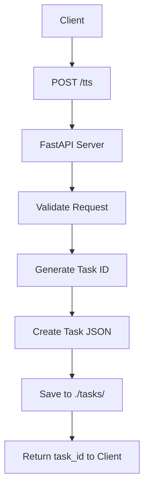
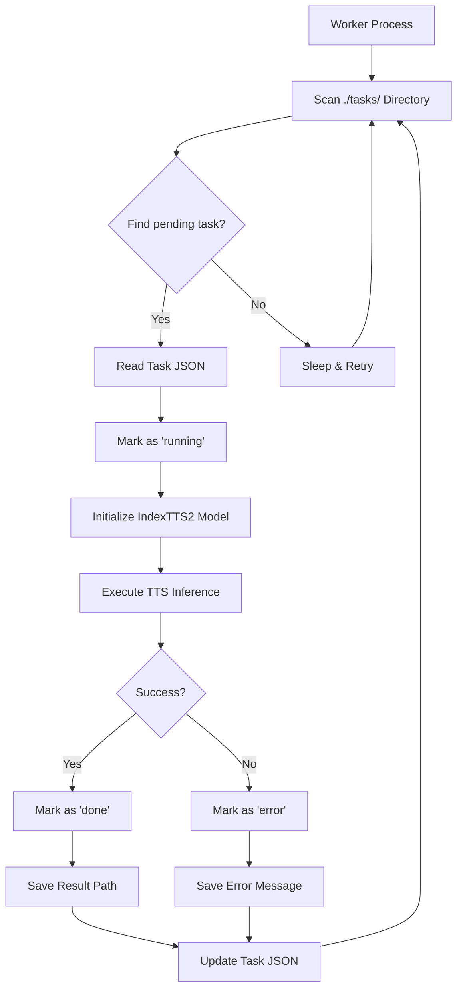

# IndexTTS2 API Documentation

## Overview

IndexTTS2 is a PyTorch-based text-to-speech system that uses autoregressive models for zero-shot voice cloning with emotional expression control. The API provides a RESTful interface for submitting TTS tasks and retrieving results asynchronously.

## Architecture

The system consists of several components:

- **FastAPI Server** (`api.py`): Handles HTTP requests and manages task queue
- **Worker Process** (`worker.py`): Background process that executes TTS tasks
- **IndexTTS2 Model** (`indextts/infer_v2.py`): Core TTS inference engine

Tasks are stored as JSON files in the `./tasks/` directory and processed asynchronously by worker processes.

## API Endpoints

### POST /tts

Submit a new TTS task for processing.

**Request Body:**
```json
{
  "params": {
    "text": "Hello world",
    "spk_audio_prompt": "examples/voice_01.wav",
    "emo_vector": [0, 0, 0, 0, 0, 0, 0, 0],
    "cfg_value": 2.0,
    "inference_timesteps": 10,
    "normalize": false,
    "denoise": false,
    "retry_badcase": true,
    "retry_badcase_max_times": 3,
    "retry_badcase_ratio_threshold": 6.0,
    "use_random": false,
    "output_path": "tasks/output.wav",
    "verbose": true
  }
}
```

**Parameters:**

| Parameter | Type | Description | Default |
|-----------|------|-------------|---------|
| `text` | string | Text to synthesize | Required |
| `spk_audio_prompt` | string | Path to speaker reference audio file | Required |
| `emo_vector` | list[float] | 8-dimensional emotion vector [happy, angry, sad, afraid, disgusted, melancholic, surprised, calm] | [0,0,0,0,0,0,0,0] |
| `cfg_value` | float | Language model guidance strength | 2.0 |
| `inference_timesteps` | int | Number of inference steps | 10 |
| `normalize` | bool | Enable external text normalization | false |
| `denoise` | bool | Enable denoising | false |
| `retry_badcase` | bool | Retry on bad cases | true |
| `retry_badcase_max_times` | int | Maximum retry attempts | 3 |
| `retry_badcase_ratio_threshold` | float | Bad case detection threshold | 6.0 |
| `use_random` | bool | Enable randomness in generation | false |
| `output_path` | string | Output WAV file path | Auto-generated |
| `verbose` | bool | Enable verbose logging | false |

**Response:**
```json
{
  "task_id": "550e8400-e29b-41d4-a716-446655440000"
}
```

### GET /tts/{task_id}

Retrieve the status and result of a specific TTS task.

**Path Parameters:**
- `task_id` (string): Unique task identifier (UUID)

**Response:**
```json
{
  "id": "550e8400-e29b-41d4-a716-446655440000",
  "status": "done",
  "result": "tasks/550e8400-e29b-41d4-a716-446655440000.wav",
  "audio_data": "data:audio/wav;base64,UklGRnoGAABXQVZFZm10...",
  "worker_id": "worker-uuid",
  "submit_time": 1700000000.0,
  "start_time": 1700000001.0,
  "end_time": 1700000010.0,
  "duration": 9.0,
  "params": {
    "text": "Hello world",
    "spk_audio_prompt": "examples/voice_01.wav"
  }
}
```

**Status Values:**
- `pending`: Task queued but not yet started
- `running`: Task currently being processed
- `done`: Task completed successfully
- `error`: Task failed with an error

### GET /tasks

Retrieve a list of TTS tasks filtered by status.

**Query Parameters:**
- `status` (string): Filter by status (`pending`, `running`, `done`, `error`) - defaults to `done`

**Response:**
```json
{
  "total": 2,
  "tasks": [
    {
      "id": "550e8400-e29b-41d4-a716-446655440000",
      "status": "done",
      "result": "tasks/550e8400-e29b-41d4-a716-446655440000.wav",
      "worker_id": "worker-uuid",
      "submit_time": 1700000000.0,
      "params": {
        "text": "Hello world"
      }
    }
  ]
}
```

## Task Submission and Execution Flow

### Overview

The IndexTTS2 API uses an asynchronous task-based architecture where TTS requests are submitted to a queue and processed by background worker processes. This enables scalable processing and prevents blocking of the API server during long-running TTS generation tasks.

### Task Lifecycle

Tasks progress through the following states:
1. **pending** → **running** → **done** / **error**

### Submission Flow



**Step-by-step process:**

1. **Client Request**: User submits TTS request via `POST /tts` with parameters in request body
2. **Validation**: API validates required parameters (`text`, `spk_audio_prompt`) and optional parameters
3. **Task Creation**: API generates unique UUID for the task
4. **Task Storage**: Task data saved as JSON file in `./tasks/{task_id}.json`:
   ```json
   {
     "id": "550e8400-e29b-41d4-a716-446655440000",
     "status": "pending",
     "result": null,
     "worker_id": null,
     "submit_time": 1700000000.0,
     "params": { /* TTS parameters */ }
   }
   ```
5. **Response**: API returns task ID immediately (non-blocking)

### Worker Execution Flow



**Worker Process Details:**

1. **Directory Monitoring**: Worker continuously scans `./tasks/` directory for `*.json` files
2. **Task Selection**: Finds first task with `"status": "pending"`
3. **Status Update**: Changes task status to `"running"`, records `worker_id` and `start_time`
4. **Model Initialization**: Loads IndexTTS2 model (cached for performance)
5. **TTS Execution**: Calls `tts_model.infer(**task_params)` with provided parameters
6. **Output Handling**: Automatically generates `output_path` if not specified
7. **Completion**: Updates task with `"status": "done"`, `result` path, `end_time`, and `duration`
8. **Error Handling**: On failure, sets `"status": "error"` and stores error message

### Status Query Flow

```mermaid
graph TD
    A[Client] --> B[GET /tts/{task_id}]
    B --> C[FastAPI Server]
    C --> D[Read Task JSON]
    D --> E{Status == 'done'?}
    E -->|Yes| F[Load Audio File]
    E -->|No| G[Return Task Data]
    F --> H[Base64 Encode Audio]
    H --> I[Add audio_data Field]
    I --> G
    G --> J[Return to Client]
```

**Query Process:**

1. **Task Retrieval**: API reads task JSON file by task_id
2. **Status Check**: Returns current task state and metadata
3. **Audio Serving**: If status is `"done"`, loads generated WAV file and returns as base64 data URI
4. **Error Reporting**: If status is `"error"`, includes error message in response

### Batch Query Flow

```mermaid
graph TD
    A[Client] --> B[GET /tasks?status=done]
    B --> C[FastAPI Server]
    C --> D[Scan ./tasks/ Directory]
    D --> E[Filter by Status]
    E --> F[Collect Task List]
    F --> G[Return {total, tasks}]
```

**Batch Process:**
1. **Directory Scan**: Reads all JSON files in `./tasks/`
2. **Filtering**: Applies status filter (default: `"done"`)
3. **Aggregation**: Returns count and list of matching tasks

### Worker Scaling

Multiple worker processes can run concurrently:

```bash
# Start multiple workers for higher throughput
uv run worker.py &
uv run worker.py &
uv run worker.py &
```

Workers automatically coordinate by:
- Each worker processes one task at a time
- No conflicts due to atomic file operations
- Shared task queue via filesystem

### Error Scenarios

**Task Submission Errors:**
- Missing required parameters → 400 Bad Request
- Invalid parameter values → 400 Bad Request
- Task ID collision → 500 Internal Server Error

**Worker Execution Errors:**
- Model loading failure → `"status": "error"`
- File I/O errors → `"status": "error"`
- Invalid audio paths → `"status": "error"`
- GPU memory issues → `"status": "error"`

**Query Errors:**
- Invalid task_id → 404 Not Found
- Corrupted task file → 500 Internal Server Error

### Performance Characteristics

- **Non-blocking**: API returns immediately after task submission
- **Scalable**: Multiple workers can process tasks in parallel
- **Fault-tolerant**: Failed tasks don't block other workers
- **Persistent**: Task state survives server restarts
- **Observable**: Real-time status monitoring via API

## Emotion Control

IndexTTS2 supports multiple emotion control methods:

### 1. Emotion Vectors
Direct 8-dimensional emotion vector:
```python
emo_vector = [0.8, 0.0, 0.0, 0.0, 0.0, 0.0, 0.0, 0.2]  # 80% happy, 20% calm
```

### 2. Emotion Reference Audio
Use a reference audio file containing the desired emotion:
```python
emo_audio_prompt = "examples/emo_sad.wav"
emo_alpha = 0.8  # Blend strength (0.0-1.0)
```

### 3. Text-Based Emotion Detection
Automatically detect emotions from text using Qwen model:
```python
use_emo_text = True
emo_text = "I'm so excited about this!"  # Optional custom emotion text
emo_alpha = 0.6
```

## Performance Optimization

### Caching
The system caches speaker and emotion conditioning to avoid recomputation when the same reference audio is used repeatedly.

### Hardware Acceleration
- **CUDA**: Automatic detection and utilization of NVIDIA GPUs
- **MPS**: Support for Apple Silicon (M1/M2/M3) Macs
- **XPU**: Support for Intel Xe GPUs
- **FP16**: Half-precision inference for reduced memory usage

### Model Compilation
```python
use_torch_compile = True  # Enable torch.compile for optimization
```

### DeepSpeed Integration
```python
use_deepspeed = True  # May improve performance on some systems
```

## Error Handling

The API includes comprehensive error handling:

- **Task Validation**: Checks for required parameters and valid file paths
- **Retry Logic**: Automatic retry for bad cases during generation
- **Timeout Handling**: Configurable timeouts for long-running tasks
- **Graceful Degradation**: Falls back to CPU if GPU is unavailable

## Deployment

### Starting the API Server
```bash
uv run api.py
```

### Starting Worker Processes
```bash
uv run worker.py
```

### Scaling
Multiple worker processes can be started to handle higher throughput:
```bash
uv run worker.py & uv run worker.py & uv run worker.py
```

## Monitoring

Task status can be monitored via:
- `/tasks?status=running` - View active tasks
- `/tasks?status=error` - Check for failed tasks
- `/tts/{task_id}` - Get detailed task information

## File Structure

```
index-tts/
├── api.py                 # FastAPI server
├── worker.py              # Background worker
├── indextts/
│   ├── infer_v2.py       # Core IndexTTS2 model
│   ├── gpt/model_v2.py   # GPT model implementation
│   └── ...
├── checkpoints/           # Model weights and config
├── tasks/                 # Task storage directory
├── frontend/              # Web UI (optional)
└── examples/              # Reference audio files
```

## Configuration

Key configuration files:
- `checkpoints/config.yaml` - Model architecture configuration
- `AGENTS.md` - Development guidelines and commands

## Security Considerations

- Input validation for all API parameters
- File path sanitization to prevent directory traversal
- CORS configuration for web UI access
- No execution of arbitrary code from user inputs</content>
<parameter name="filePath">api.md